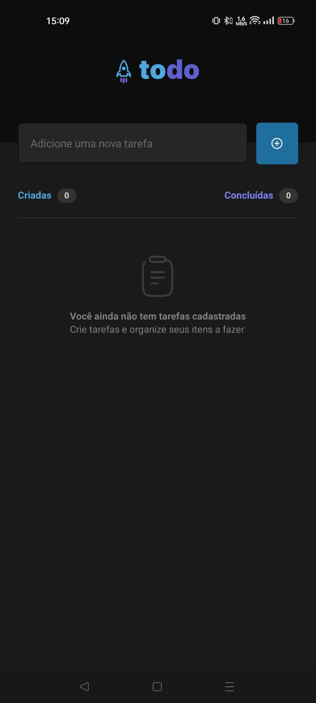
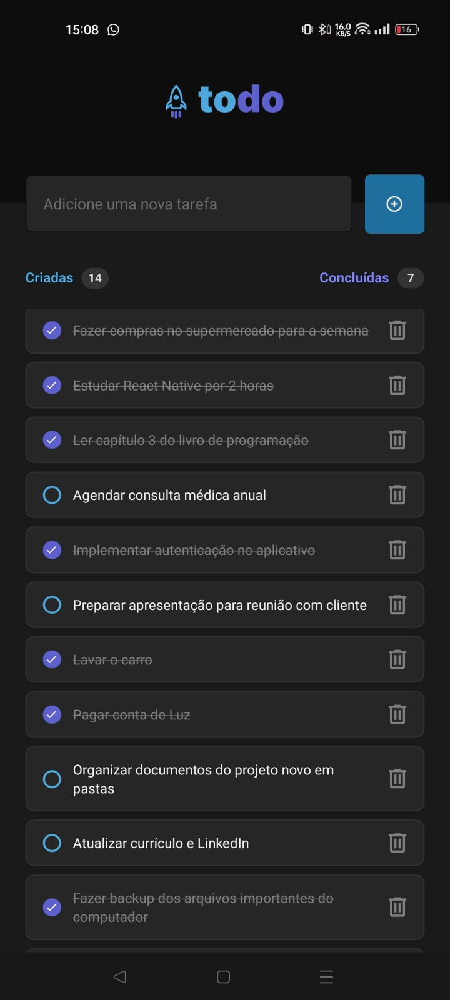
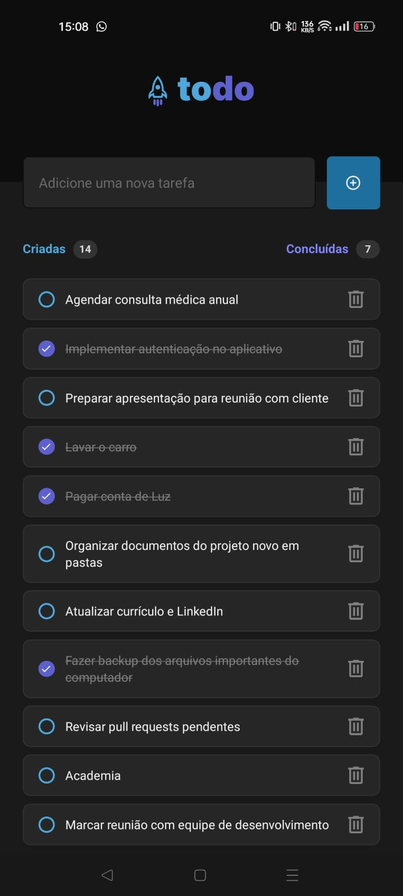
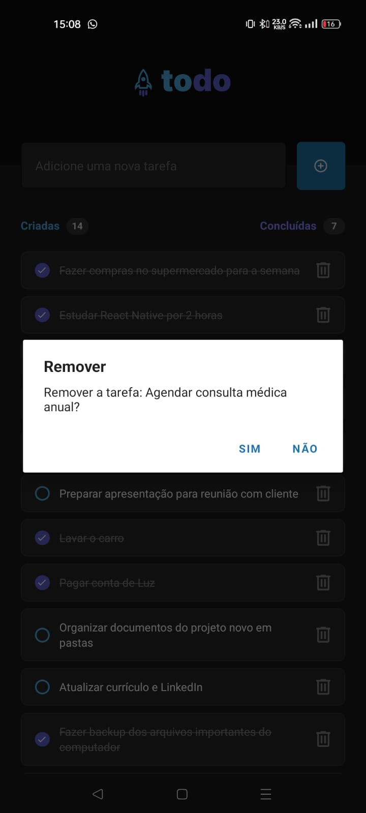

div]:bg-bg-300  [&amp;_.ignore-pre-bg>div]:bg-transparent  [&amp;_pre]:-mr-4  md:[&amp;_pre]:-mr-9">

_*]:min-w-0"><h1 class="font-600 text-2xl font-bold" level="1">ToDo App</h1>

Um aplicativo de gerenciamento de tarefas desenvolvido com React Native, Expo, TypeScript e Zustand.

<h2 class="font-600 text-xl font-bold" level="2">Funcionalidades</h2>
<ul class="-mt-1 [li>&amp;]:mt-2 list-disc space-y-2 pl-8" depth="0">
<li class="whitespace-normal break-words" index="0">Criar, atualizar e deletar tarefas</li>
<li class="whitespace-normal break-words" index="1">Marcar e desmarcar tarefas como concluídas</li>
<li class="whitespace-normal break-words" index="2">Contador de tarefas criadas e concluídas</li>
<li class="whitespace-normal break-words" index="3">Interface limpa e intuitiva</li>
<li class="whitespace-normal break-words" index="4">Validação de entrada</li>
<li class="whitespace-normal break-words" index="5">Persistência de dados com Zustand</li>
</ul>

  
  
  
  

<h2 class="font-600 text-xl font-bold" level="2">Tecnologias</h2>
<ul class="-mt-1 [li>&amp;]:mt-2 list-disc space-y-2 pl-8" depth="0">
<li class="whitespace-normal break-words" index="0">React Native</li>
<li class="whitespace-normal break-words" index="1">Expo</li>
<li class="whitespace-normal break-words" index="2">TypeScript</li>
<li class="whitespace-normal break-words" index="3">Zustand (Gerenciamento de Estado)</li>
<li class="whitespace-normal break-words" index="4">React Native Vector Icons</li>
<li class="whitespace-normal break-words" index="5">React Native SVG</li>
</ul>
<h2 class="font-600 text-xl font-bold" level="2">Executando o projeto</h2>
<ol class="-mt-1 [li>&amp;]:mt-2 list-decimal space-y-2 pl-8" depth="0">
<li class="whitespace-normal break-words" index="0">Clone o repositório</li>
</ol>
<pre>

<code class="language-bash" style="background: rgb(40, 44, 52); color: rgb(171, 178, 191); text-shadow: rgba(0, 0, 0, 0.3) 0px 1px; font-family: &quot;Fira Code&quot;, &quot;Fira Mono&quot;, Menlo, Consolas, &quot;DejaVu Sans Mono&quot;, monospace; direction: ltr; text-align: left; white-space: pre; word-spacing: normal; word-break: normal; line-height: 1.5; tab-size: 2; hyphens: none;">git clone https://github.com/seunome/todo-app.git
cd todo-app</code>

</pre>
<ol class="-mt-1 [li>&amp;]:mt-2 list-decimal space-y-2 pl-8" start="2" depth="0">
<li class="whitespace-normal break-words" index="0">Instale as dependências</li>
</ol>
<pre>

<code class="language-bash" style="background: rgb(40, 44, 52); color: rgb(171, 178, 191); text-shadow: rgba(0, 0, 0, 0.3) 0px 1px; font-family: &quot;Fira Code&quot;, &quot;Fira Mono&quot;, Menlo, Consolas, &quot;DejaVu Sans Mono&quot;, monospace; direction: ltr; text-align: left; white-space: pre; word-spacing: normal; word-break: normal; line-height: 1.5; tab-size: 2; hyphens: none;">npm install</code>

</pre>
<ol class="-mt-1 [li>&amp;]:mt-2 list-decimal space-y-2 pl-8" start="3" depth="0">
<li class="whitespace-normal break-words" index="0">Inicie o projeto</li>
</ol>
<pre>

<code class="language-bash" style="background: rgb(40, 44, 52); color: rgb(171, 178, 191); text-shadow: rgba(0, 0, 0, 0.3) 0px 1px; font-family: &quot;Fira Code&quot;, &quot;Fira Mono&quot;, Menlo, Consolas, &quot;DejaVu Sans Mono&quot;, monospace; direction: ltr; text-align: left; white-space: pre; word-spacing: normal; word-break: normal; line-height: 1.5; tab-size: 2; hyphens: none;">npm run start</code>

</pre>
<h2 class="font-600 text-xl font-bold" level="2">Estrutura do Projeto</h2>
<pre>

<code style="background: rgb(40, 44, 52); color: rgb(171, 178, 191); text-shadow: rgba(0, 0, 0, 0.3) 0px 1px; font-family: &quot;Fira Code&quot;, &quot;Fira Mono&quot;, Menlo, Consolas, &quot;DejaVu Sans Mono&quot;, monospace; direction: ltr; text-align: left; white-space: pre; word-spacing: normal; word-break: normal; line-height: 1.5; tab-size: 2; hyphens: none;">src/
  ├── assets/        # Imagens, ícones e outros arquivos estáticos
  ├── shared/        # Recursos reutilizáveis
  ├── screens/       # Telas da aplicação
  ├── store/         # Configuração da store do Zustand
  └── types/         # Definições de tipos TypeScript</code>

</pre>
<h2 class="font-600 text-xl font-bold" level="2">Gerenciamento de Estado</h2>

O aplicativo usa Zustand para gerenciamento de estado. A store é configurada para lidar com o gerenciamento das tarefas.

<pre>

<code class="language-typescript" style="background: rgb(40, 44, 52); color: rgb(171, 178, 191); text-shadow: rgba(0, 0, 0, 0.3) 0px 1px; font-family: &quot;Fira Code&quot;, &quot;Fira Mono&quot;, Menlo, Consolas, &quot;DejaVu Sans Mono&quot;, monospace; direction: ltr; text-align: left; white-space: pre; word-spacing: normal; word-break: normal; line-height: 1.5; tab-size: 2; hyphens: none;">import { create } from 'zustand';
import { Task } from '../types/task';

interface TasksState {
  todoList: Task[];
  onAdd: (task: Task) =&gt; void;
  onDelete: (id: number) =&gt; void;
  onCheck: (id: number, status: boolean) =&gt; void;
}

export const useTasksStore = create&lt;TasksState&gt;((set, get) =&gt; ({
  todoList: [],
  onAdd: (task) =&gt; {
    const list = get().todoList;
    const newList: Task[] = [...list, task];

    set({ todoList: newList });
  },
  onDelete: (id) =&gt; {
    const list = get().todoList;
    const newList = list.filter((task) =&gt; task.id !== id);

    set({ todoList: newList });
  },
  onCheck: (id, status) =&gt; {
    const list = get().todoList;
    const newList = list.map((task) =&gt; {
      if (task.id !== id) return task;
      return { ...task, done: status };
    });

    set({ todoList: newList });
  },
}));</code>

</pre>
<h2 class="font-600 text-xl font-bold" level="2">Componentes</h2>

O aplicativo inclui os seguintes componentes:

<ul class="-mt-1 [li>&amp;]:mt-2 list-disc space-y-2 pl-8" depth="0">
<li class="whitespace-normal break-words" index="0">Lista de Tarefas</li>
<li class="whitespace-normal break-words" index="1">Item de Tarefa</li>
<li class="whitespace-normal break-words" index="2">Formulário de Criação</li>
<li class="whitespace-normal break-words" index="3">Cabeçalho da Lista</li>
<li class="whitespace-normal break-words" index="4">Estado de Lista Vazia</li>
<li class="whitespace-normal break-words" index="5">Radio Button Personalizado</li>
</ul>
<h2 class="font-600 text-xl font-bold" level="2">Como Contribuir</h2>
<ol class="-mt-1 [li>&amp;]:mt-2 list-decimal space-y-2 pl-8" depth="0">
<li class="whitespace-normal break-words" index="0">Faça um fork do repositório</li>
<li class="whitespace-normal break-words" index="1">Crie sua branch de feature (<code class="bg-text-200/5 border border-0.5 border-border-300 text-danger-000 whitespace-pre-wrap rounded-[0.3rem] px-1 py-px text-[0.9rem]">git checkout -b feature/NovaFuncionalidade</code>)</li>
<li class="whitespace-normal break-words" index="2">Faça commit de suas alterações (<code class="bg-text-200/5 border border-0.5 border-border-300 text-danger-000 whitespace-pre-wrap rounded-[0.3rem] px-1 py-px text-[0.9rem]">git commit -m 'Adiciona nova funcionalidade'</code>)</li>
<li class="whitespace-normal break-words" index="3">Faça push para a branch (<code class="bg-text-200/5 border border-0.5 border-border-300 text-danger-000 whitespace-pre-wrap rounded-[0.3rem] px-1 py-px text-[0.9rem]">git push origin feature/NovaFuncionalidade</code>)</li>
<li class="whitespace-normal break-words" index="4">Abra um Pull Request</li>
</ol>
<h2 class="font-600 text-xl font-bold" level="2">Licença</h2>

Este projeto está licenciado sob a Licença MIT - veja o arquivo <a href="LICENSE">LICENSE</a> para detalhes.

<h2 class="font-600 text-xl font-bold" level="2">Contato</h2>

Seu Nome - <a href="https://twitter.com/seutwitter">@seutwitter</a>

Link do Projeto: <a href="https://github.com/seunome/todo-app">https://github.com/seunome/todo-app</a>

<h2 class="font-600 text-xl font-bold" level="2">Agradecimentos</h2>
<ul class="-mt-1 [li>&amp;]:mt-2 list-disc space-y-2 pl-8" depth="0">
<li class="whitespace-normal break-words" index="0"><a href="https://docs.expo.dev/">Documentação do Expo</a></li>
<li class="whitespace-normal break-words" index="1"><a href="https://reactnative.dev/docs/getting-started">Documentação do React Native</a></li>
<li class="whitespace-normal break-words" index="2"><a href="https://github.com/pmndrs/zustand">Documentação do Zustand</a></li>
</ul>

